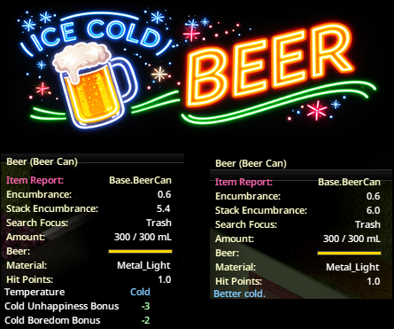

# Ice Cold Beer [B42]

A lightweight Project Zomboid Build 42 mod that makes certain drinks feel better when they are actually chilled.

Steam Workshop:
https://steamcommunity.com/sharedfiles/filedetails/?id=3684324175

Supported cold-bonus drinks:
- Beer
- White wine and wine cartons
- Champagne
- Cider
- Soda and pop
- Juice
- Milk

What it does:
- Adds a small boredom and unhappiness reduction when a supported drink is cold but not frozen
- Shows a vanilla-style `Better cold.` tooltip note when a supported drink is not chilled enough yet
- Shows extra cold-bonus tooltip rows once the drink is properly chilled
- Adds in-game mod options for configuring cold boredom and unhappiness bonuses by drink category
- Supports an advanced custom item-id allowlist for modded drinks
- Includes English, Spanish, and Turkish tooltip translations

Configurable cold bonus options:
- Built-in drink groups have separate in-game boredom and unhappiness sliders
- Advanced users can add extra full item IDs, such as `SomeMod.FancySoda`, to a custom cold-target list
- Custom item IDs use their own configurable boredom and unhappiness values
- Invalid or non-drink item IDs are safely ignored by the gameplay checks
- See `ROADMAP.md` for follow-up improvements and remaining design questions

Project layout:
- Workshop-style root: `Contents/mods/IceColdBeer`
- Build-specific mod payload: `Contents/mods/IceColdBeer/42.15`
- Required shared folder: `Contents/mods/IceColdBeer/common`

Local testing:
- Active local mod path: `C:\Users\AT\Zomboid\mods\IceColdBeerLocal\42.15`
- After editing files here, sync the updated contents into that local mod folder before testing in-game
- See `TESTING.md` for a quick smoke-test checklist and optional debug logging

Notes:
- This project follows the current Build 42 packaging guidance of using versioned mod folders and a `common` folder.
- Current development version is `modversion=1.0.9` in `mod.info`.
- Known issue: on the current Build 42 UI, the extra cold bonus tooltip values can appear slightly misaligned even though the tooltip logic and mood effects work correctly.
- No open-source license has been added yet. All rights remain with the author unless you choose a license later.
- This is an unofficial fan-made mod and is not affiliated with The Indie Stone.
